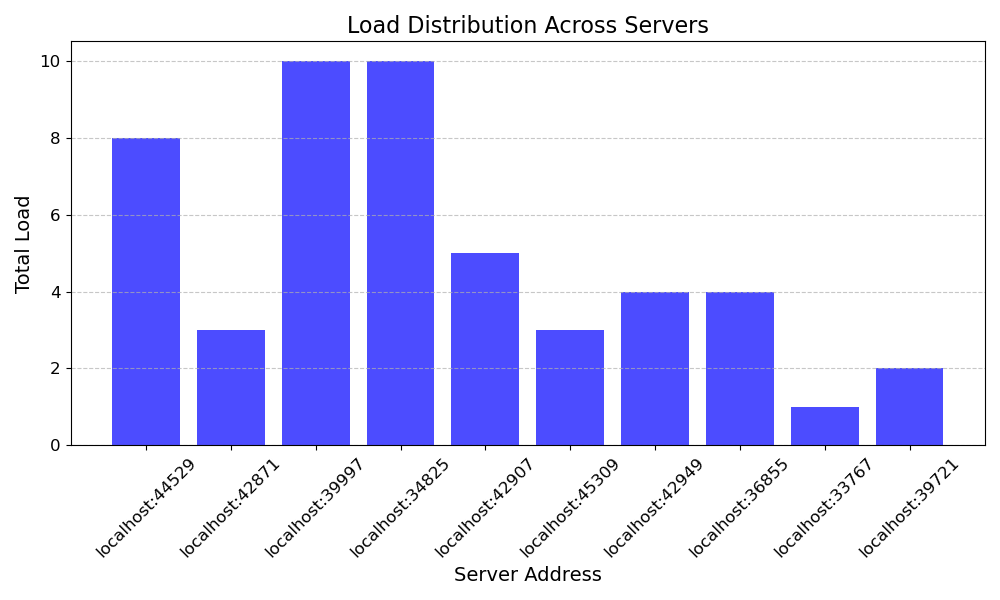
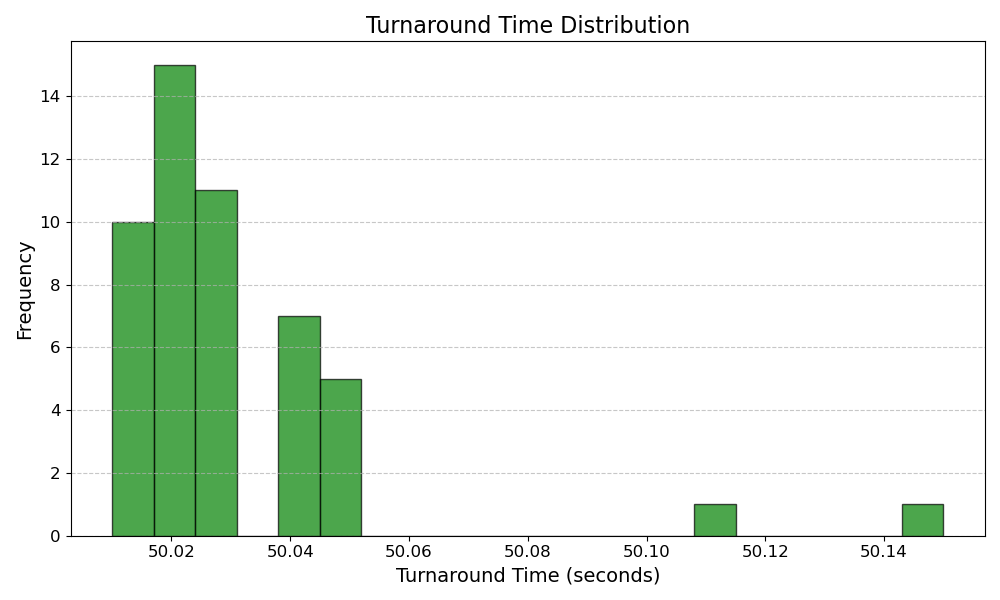
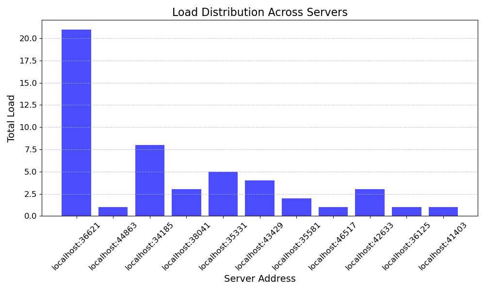
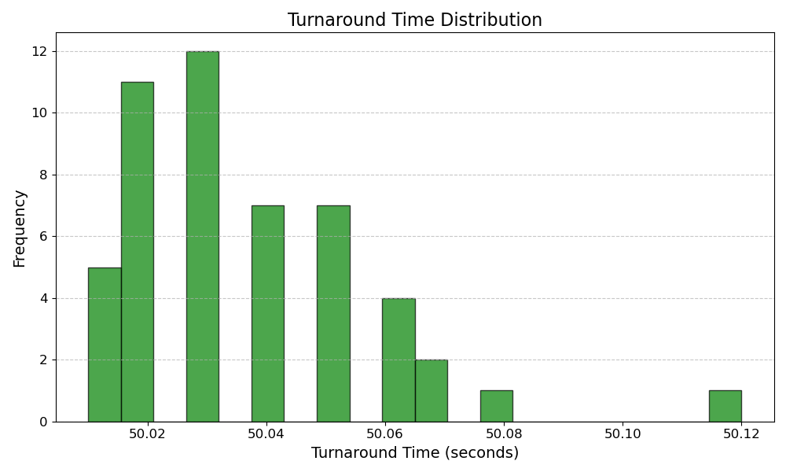

<!-- https://stackoverflow.com/questions/56766921/multiple-unary-rpc-calls-vs-long-running-bidirectional-streaming-in-grpc this is why i do unary rpc

https://www.pixelstech.net/article/1615108646-Service-discovery-with-etcd for etcd
 -->

# Why there is no point bothering about pick first

It will always pick the first thing it finds, and in our current setting there is only going to be one server that it picks everytime, so the graphs for it have not been drawn right now. This is not to say that the pick first policy is always a poor pick. One very important use case for it will be when optimizing the "hot path" is important, if the selection policy needs to be very quick then it wouldn't want to do any extra work like round robin (locking) or least loaded (picking off a priority queue). Moreover, with networks that have frequent exits and entries for nodes, pick first will become equivalent to a pick random for no added delay on the critical path.

# Round Robin and Least Loaded are similar in ideal settings

Least loaded is just a tad bit worse because of the extra checks it needs to do to find the minimally loaded server. On that note, I have used a combination of CPU load percentage on each node and the number of tasks as a tie-breaker to pick the least loaded server. This was done because when there are VERY high loads, the go routines running each client task will swamp the CPU to 100% load, and then we will _kinda_ be using round robin since it is going to balance by task load under extreme load, and under low load it will handoff to the least loaded server. Moreover, when clients bombard in rapid succession, since heartbeats take sometime to come and inform about the load and availability -- the policy may behave like pick first for a short duration.

## Round Robin plots

## Least Loaded plots

