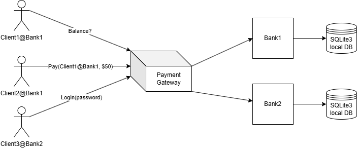
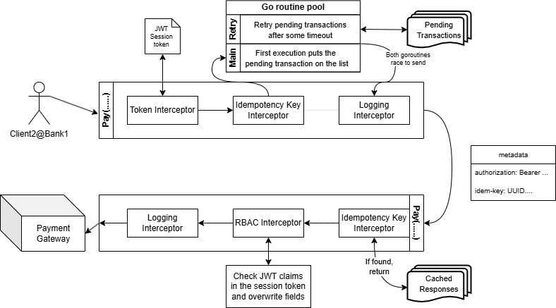

# Stripe Clone - Strife

The basic picture of the whole system is shown below. I have used `Golang` to implement the logic, `gRPC` for communication and `SQLite3` for storage. Other technologies used were `bcrypt` to hash and safely store passwords, `openssl` for mutual TLS, `JWT` for session tokens and `UUID`s for idempotency keys.



## Secure authentication

A root CA is generated and is available to all parties (clients, gateway and banks) to verify certificates for mutual TLS to prevent eavesdropping. All connections are only made by completing two way encryption (client $\leftrightarrow$ gateway, gateway $\leftrightarrow$ bank). Major thanks [to this reference](https://dev.to/techschoolguru/how-to-secure-grpc-connection-with-ssl-tls-in-go-4ph). By doing this we can send plaintext password over the wire without worrying about eavesdropping, at the bank this password will be `bcrypt`ed by a only known to the local so the passwords are safely stored.

A client can only start making queries AFTER it has logged in obtained a valid JWT session teken (explained further in the next section). If a login fails, just start again. This is in line with how payment gateway services work otherwise useless offline payments would get queued up and flood the wire after a successful login.

## Role based authorization and access control

All methods of the `StripeService` have their `method.options` extended to support a list of roles and if they can be called even if a role is not available for the caller. For example, `ClientLogin()` can be called without having a role assigned in the JST claims (since a client that has not logged in will not have a session token with claims). This is indicated by keeping the `allow_unauthenticated` as true.
```proto
rpc ClientLogin(ClientLoginRequest) returns (ClientSessionResponse) {
    option (services.common.genproto.comms.access_control) = {
        allowed_roles: [],
        allow_unauthenticated: true
    };
}
```

Whereas, calls like `CheckBalance()` cannot be made without a valied JWT session token having a claim with valid role assigned to it by the bank (cannot be spoofed by the client since its PROPERLY hashed). Since this requires RBAC, `allow_unauthenticated` is set to false, and a list of valid roles is assigned.
```proto
rpc CheckBalance(CheckBalanceRequest) returns (CheckBalanceResponse) {
    option (services.common.genproto.comms.access_control) = {
        allowed_roles: [CUSTOMER, ADMIN],
        allow_unauthenticated: false
    };
}
```

By keeping the RBAC requirements baked into the protofiles, we make RBAC a requirement that is language agnostic. The burden of writing good interceptors lies with the service logic, it now has to abide by the proto definitions. On that note, yes we have RBAC interceptors and JWT interceptors to allow authentication, authorization and access control. On the client side, every outgoing RPC call is intercepted by the `TokenUnaryInterceptor` and the currently stored JWT session token (empty if no session token here) is added to the outgoing context metadata.

At the gateway, all calls are intercepted by the RBAC interceptor, which forwards the calls directly if it has `allow_unauthenticated` set as true. Otherwise, it is passed to a JWT handler that extracts the claims and overwrites fields and role to avoid spoofing and then passes the request forward. Then a check is done to ensure that the role in the session token is allowed to go forward.

## Logging

Logging interceptors and general log statements have been added everywhere.

## Idempotent payments

All outgoing calls from the client are intercepted by the idempotency interceptor after they pass through the token interceptor. Here, we generate a UUID as the idempotency key and add it to the metadata storage. All incoming calls are intercepted by the idempotency interceptor at the gateway and if a cached response of that key is already present, then we return the response and don't forward the request. Otherwise, the response is forwarded and added to the cache once its result becomes available. This guarantees that unless the idempotency keys accidentally match, all client requests will only go through once before getting cached and blocked. The probabilty of two UUIDs colliding is less than the probabilty of the data center being destroyed in a nuclear strike (yes, [source](https://jhall.io/archive/2021/05/19/what-are-the-odds/)).

## Offline payments

The idempotency interceptor also does something really cool. A transaction manager maintains a list of all pending transactions (i.e., transactions that haven't received aresponse yet), transactions are added to this when going out, and popped when a response is received. A go routine periodically checks if pending transactions haven't been retried since a long time, and invokes it again. This side-effect based behaviour makes it very easy to add new RPCs and services without having to implement their retry behaviour again. Below is an image of the flow summarizing everything above.



## Bank Registration

All banks have access to an SQLLite3 database locally, they may choose to implement a different database since our system has no dependencies on secondary storage. When the bank server runs, it sends a `BankRegister()` RPC to the gateway with an address for the gateway to dial to. This address is a random port on the bank server, finally they connect on this with mTLS. Banks may employ the same or different certificates on their end - no dependencies there. 

An initial seeder runs at the time of initialization that inserts test users into the bank. If more clients need to be dynamically added, we can extend the `StripeService` to include RPCs with `allowed_roles: [ADMIN]` - for the scope of this assignment it is not needed.

## 2PC + Timeout

Only paying another user is allowed in this setup. The sender specifies the username and bankname of the recepient and the amount they wish to transfer. Once the request properly reaches the payment gateway after all the interceptors, we begin a modified two-phase commit process as described on its [page on wikipedia](https://en.wikipedia.org/wiki/Two-phase_commit_protocol#Basic_algorithm). Here, it is not possible to guarantee a 100% fault tolerant two phase commit. The algorithm was always meant to fail at minor chance events; and it will work at scale.

As mentioned on the wikipedia page, if both the gateway and a bank server fail, it is impossible to recover and is usually done manually by tracing logs. If the coordinator fails then either a vote is not tried or a commit never happens both of which are safe. If a bank server does not fail indefinitely then the commit/rollback will eventually reach it and finish the transaction and/or the vote will eventually be taken. Below is an image of the flow summarizing everything above.


